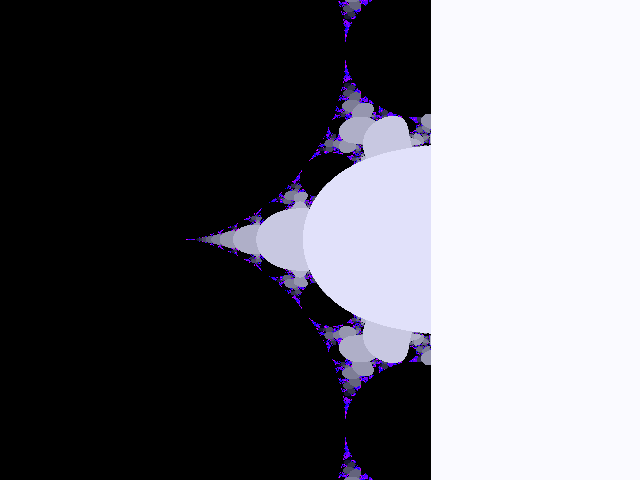

# Mandelbrot
A parallel algorithm for drawing Mandelbrot set.



## Development

```bash
# Compile the packages.
$ mvn clean compile assembly:single
# Run an example.
$ java -jar target/mandelbrot-1.0-SNAPSHOT-jar-with-dependencies.jar -t 1 -g 8 -q
# Ask for help.
$ java -jar target/mandelbrot-1.0-SNAPSHOT-jar-with-dependencies.jar -h
```